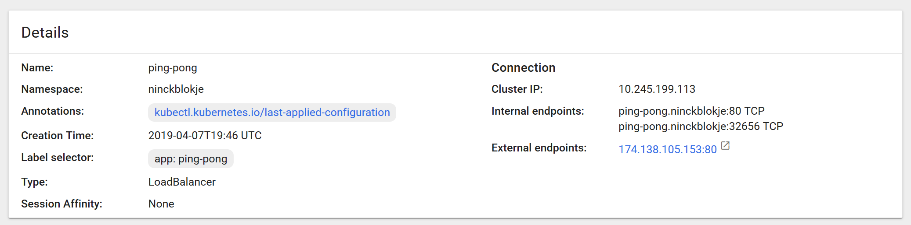

# Opdracht 3: Pod ontsluiting

Achtergrond informatie: https://kubernetes.io/docs/concepts/services-networking/service/

1. Voeg een selector toe aan service.yaml onder spec:

````yaml
...
spec:
  selector:
    app: ping-pong
...
````

2. Deploy de service: `kubectl apply -n ninckblokje -f service.yaml`

Controleer dat deze goed is aangemaakt:

````
$ kubectl get -n ninckblokje svc
NAME        TYPE        CLUSTER-IP      EXTERNAL-IP   PORT(S)   AGE
ping-pong   ClusterIP   10.245.25.199   <none>        80/TCP    6s
````

2. Verbinding maken via een service:

````
$ kubectl port-forward -n ninckblokje svc/ping-pong 80:80
Forwarding from 127.0.0.1:80 -> 8080
Forwarding from [::1]:80 -> 8080
````

Open de pagina: http://localhost:80/ping

Dit is ongeveer de output: `2019-04-07T19:39:22Z Pong from ping-pong`

Controleer de pod logs:

````
$ kubectl logs -n ninckblokje ping-pong
/ping: map[Accept:[text/html,application/xhtml+xml,application/xml;q=0.9,*/*;q=0.8] Accept-Language:[nl,en-US;q=0.7,en;q=0.3] Dnt:[1] Connection:[keep-alive] Upgrade-Insecure-Requests:[1] User-Agent:[Mozilla/5.0 (Windows NT 10.0; Win64; x64; rv:66.0) Gecko/20100101 Firefox/66.0] Accept-Encoding:[gzip, deflate] Cookie:[m=]]
/ping: map[Accept-Encoding:[gzip, deflate] Connection:[keep-alive] Cookie:[m=] Accept:[text/html,application/xhtml+xml,application/xml;q=0.9,*/*;q=0.8] Accept-Language:[nl,en-US;q=0.7,en;q=0.3] Dnt:[1] Upgrade-Insecure-Requests:[1] User-Agent:[Mozilla/5.0 (Windows NT 10.0; Win64; x64; rv:66.0) Gecko/20100101 Firefox/66.0]]
````

3. Ping de service in het cluster

````
$ kubectl exec -it -n ninckblokje sleeper /bin/bash
[root@sleeper /]# $ wget http://ping-pong/ping
[root@sleeper /]# $ wget http://ping-pong.ninckblokje/ping
````

Probeer ook een service in een andere namespace te pingen.

4. Service extern beschikbaar maken

Verwijder de service eerst: `kubectl delete -n ninckblokje svc/ping-pong`

Maak een kopie van het bestand `service.yaml` genaamd `service-lbr.yaml` en voeg hier aan toe onder `spec`: `type: LoadBalancer`. Maak de nieuwe service aan (van het type load balancer): `kubectl apply -n ninckblokje -f service-lbr.yaml`

Wacht enige tijd op de load balancer en de service. Het onderstaande commando moet een external IP aangeven:

````
$ kubectl get -n ninckblokje svc
NAME        TYPE           CLUSTER-IP       EXTERNAL-IP       PORT(S)        AGE
ping-pong   LoadBalancer   10.245.199.113   174.138.105.153   80:32656/TCP   2m45s
````




Open nu de URL: http://[EXTERNAL_IP]/[ping]