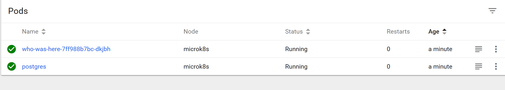
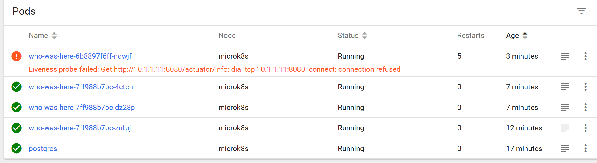

# Opdracht 6: Probes

Achtergrond informatie: https://kubernetes.io/docs/tasks/configure-pod-container/configure-liveness-readiness-probes/

De who-was-here applicatie heeft een lange opstart tijd nodig. Deploy who-was-here (nu via een deployment met daarbij een service) en controleer het via de health endpoints (van Spring Boot Actuator):



````
$ kubectl apply -n ninckblokje -f who-was-here.yaml
$ kubectl port-forward -n ninckblokje svc/who-was-here 80:80
$ curl http://localhost:80/actuator/info
curl: (52) Empty reply from server
...
{}
$ curl http://localhost:80/actuator/health
{"status":"DOWN"}
...
{"status":"UP"}
...
````

Verhoog nu het aantal replicas naar 3 en deploy opnieuw.

De pods zijn meteen beschikbaar en routeerbaar door de service.

Kopieer het bestand `who-was-here.yaml` naar `who-was-here-probes.yaml` en voeg onder `containers` een `livenessProbe` toe:

````yaml
...
        livenessProbe:
          httpGet:
            path: /actuator/info
            port: 8080
...
````

Deploy hem opnieuw:

````
$ kubectl apply -n ninckblokje -f who-was-here-probes.yaml
````

De pod start nu niet meer.



Voeg een delay toe:

````yaml
...
        livenessProbe:
          httpGet:
            path: /actuator/info
            port: 8080
          initialDelaySeconds: 65
...
````

````
$ kubectl apply -n ninckblokje -f who-was-here-probes.yaml
````

Voeg onder `containers` een `readinessProbe` toe:

````yaml
...
        readinessProbe:
          httpGet:
            path: /actuator/health
            port: 8080
          initialDelaySeconds: 95
...
````

Deploy hem nu opnieuw.

````
$ kubectl apply -n ninckblokje -f who-was-here-probes.yaml
````

Nu wordt de pod pas routeerbaar voor de service als beide probes ok zijn.