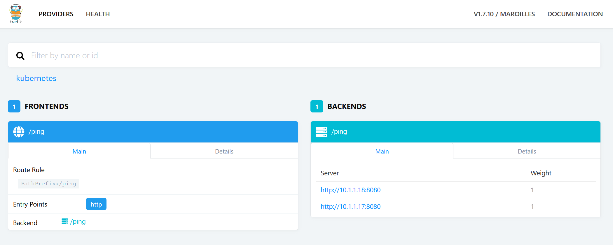

# Opdracht 8: Ingress

In de namespace `kube-system` draait Traefik, geconfigureerd als Ingress controller. Traefik is zelf geexposed als een service.

````
$ kubectl get -n kube-system po,svc
NAME                                              READY   STATUS    RESTARTS   AGE
pod/hostpath-provisioner-6d744c4f7c-dwdqx         1/1     Running   3          44h
pod/kube-dns-6bfbdd666c-scg2d                     3/3     Running   9          44h
pod/kubernetes-dashboard-5f7b999d65-79xs7         1/1     Running   3          44h
pod/traefik-ingress-controller-7cc5c78dfd-fb2c7   1/1     Running   0          15m

NAME                              TYPE        CLUSTER-IP       EXTERNAL-IP   PORT(S)         AGE
service/kube-dns                  ClusterIP   10.152.183.10    <none>        53/UDP,53/TCP   44h
service/kubernetes-dashboard      ClusterIP   10.152.183.111   <none>        443/TCP         44h
service/traefik-ingress-service   NodePort    10.152.183.231   <none>        80:32538/TCP    15m
````

De Traefik admin console is alleen exposed op de pod en kan zo bereikt worden:

````
$ kubectl port-forward -n kube-system traefik-ingress-controller-7cc5c78dfd-fb2c7 8080:8080
````

Open dan de URL: http://localhost:8080



Ingress rules aangemaakt in Kubernetes worden automatisch opgepakt door Traefik.

Delete oude pods en services:

````
$ kubectl delete -n ninckblokje po,svc --all
````

Deploy `ping-pong.yaml`. Hierin zit alleen een service, geen Ingress rule (deze wordt dus ook niet getoond door Traefik).

Vervang in `ping-pong-postgres.yaml` het path met de juiste namespace (bijvoorbeeld `/ninckblokje`). Deploy nu `ping-pong-ingress.yaml`, na korte tijd zal de rule bekend worden in Traefik.

Zoek het external IP op van de Traefik service:

````
$ kubectl get -n kube-system svc
NAME                      TYPE        CLUSTER-IP       EXTERNAL-IP      PORT(S)         AGE
kube-dns                  ClusterIP   10.152.183.10    <none>           53/UDP,53/TCP   2d
kubernetes-dashboard      ClusterIP   10.152.183.111   <none>           443/TCP         2d
traefik-ingress-service   NodePort    10.152.183.231   174.138.105.153  80:32538/TCP    4h34m
````

Doe nu een cURL:

````
$ curl http://174.138.105.153/ninckblokje/ping
404 page not found
````

`/ninckblokje` moet er door Traefik worden afgehaald voordat deze wordt doorgestuurd naar de service. Via annotations is het mogelijk om Traefik per Ingress te configureren. Voeg de volgende annotation toe: `traefik.ingress.kubernetes.io/rule-type: PathPrefixStrip`. Redeploy nu de Ingress rule:

````
$ kubectl replace -n ninckblokje ping-pong-ingress.yam
````

`````
$ curl http://174.138.105.153/ninckblokje/ping
2019-04-14T20:35:42Z Pong from ping-pong-64c8c7c695-mpx2f
$ curl http://174.138.105.153/ninckblokje/ping
2019-04-14T20:35:47Z Pong from ping-pong-64c8c7c695-28bc
````

Voeg nu een gegarandeerd nietbestaande hostname toe:

````yaml
...
  - host: ninckblokje.bnb
    http:
      paths:
      - path: /ninckblokje
...
````

Doe nogmaals een cURL (één zonder `Host` header en één keer met):

````
$ curl http://174.138.105.153/ninckblokje/ping
404 page not found
$ curl -H "Host: ninckblokje.bnb" http://174.138.105.153/ninckblokje/ping
2019-04-14T20:37:37Z Pong from ping-pong-64c8c7c695-mpx2f
````