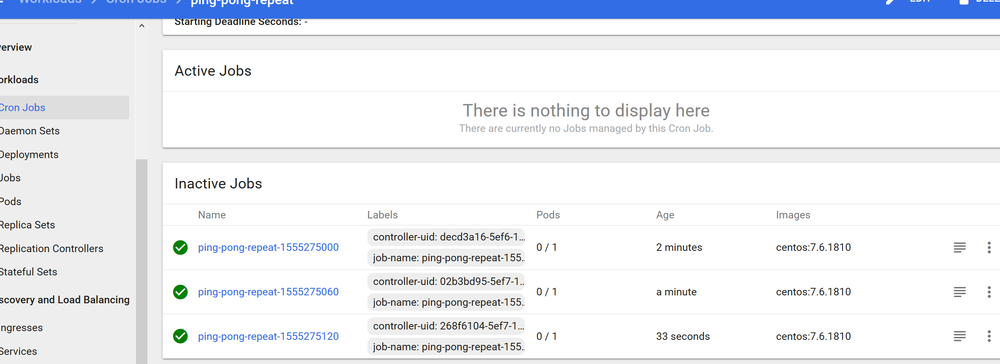

# Opdracht 9: Jobs

Deploy een eenmalige job:

````
$ kubectl apply -n ninckblokje -f ping-pong-once.yaml
$ kubectl describe -n ninckblokje jobs/ping-pong-once
Name:           ping-pong-once
Namespace:      ninckblokje
Selector:       controller-uid=37b5d18a-5ef6-11e9-a6d2-00155d021822
Labels:         controller-uid=37b5d18a-5ef6-11e9-a6d2-00155d021822
                job-name=ping-pong-once
Annotations:    kubectl.kubernetes.io/last-applied-configuration:
                  {"apiVersion":"batch/v1","kind":"Job","metadata":{"annotations":{},"name":"ping-pong-once","namespace":"ninckblokje"},"spec":{"template":{...
Parallelism:    1
Completions:    1
Start Time:     Sun, 14 Apr 2019 22:45:20 +0200
Completed At:   Sun, 14 Apr 2019 22:45:30 +0200
Duration:       10s
Pods Statuses:  0 Running / 1 Succeeded / 0 Failed
Pod Template:
  Labels:  controller-uid=37b5d18a-5ef6-11e9-a6d2-00155d021822
           job-name=ping-pong-once
  Containers:
   ping-pong-once:
    Image:      centos:7.6.1810
    Port:       <none>
    Host Port:  <none>
    Command:
      /bin/bash
    Args:
      -c
      yum install -y curl; curl http://ping-pong/ping
    Environment:  <none>
    Mounts:       <none>
  Volumes:        <none>
Events:
  Type    Reason            Age    From            Message
  ----    ------            ----   ----            -------
  Normal  SuccessfulCreate  5m20s  job-controller  Created pod: ping-pong-once-62pg4
$ kubectl logs -n ninckblokje ping-pong-once-62pg4
Loaded plugins: fastestmirror, ovl
Determining fastest mirrors
 * base: ftp.nluug.nl
 * extras: mirror.nforce.com
 * updates: mirror.nforce.com
Package curl-7.29.0-51.el7.x86_64 already installed and latest version
Nothing to do
  % Total    % Received % Xferd  Average Speed   Time    Time     Time  Current
                                 Dload  Upload   Total   Spent    Left  Speed
100    57  100    57    0     0   6272      0 --:--:-- --:--:-- --:--:--  6333
2019-04-14T20:45:30Z Pong from ping-pong-64c8c7c695-mpx2f
````

Deploy een job die elke minuut loopt (via een cron schedule:

````
$ kubectl apply -n ninckblokje -f ping-pong-repeat.yaml
$ kubectl describe -n ninckblokje cronjobs/ping-pong-repeat
Name:                          ping-pong-repeat
Namespace:                     ninckblokje
Labels:                        <none>
Annotations:                   kubectl.kubernetes.io/last-applied-configuration:
                                 {"apiVersion":"batch/v1beta1","kind":"CronJob","metadata":{"annotations":{},"name":"ping-pong-repeat","namespace":"ninckblokje"},"spec":{"...
Schedule:                      */1 * * * *
Concurrency Policy:            Allow
Suspend:                       False
Successful Job History Limit:  824633941404
Failed Job History Limit:      1
Starting Deadline Seconds:     <unset>
Selector:                      <unset>
Parallelism:                   <unset>
Completions:                   <unset>
Pod Template:
  Labels:  <none>
  Containers:
   ping-pong-repeat:
    Image:      centos:7.6.1810
    Port:       <none>
    Host Port:  <none>
    Command:
      /bin/bash
    Args:
      -c
      yum install -y curl; curl http://ping-pong/ping
    Environment:     <none>
    Mounts:          <none>
  Volumes:           <none>
Last Schedule Time:  Sun, 14 Apr 2019 22:51:00 +0200
Active Jobs:         <none>
Events:
  Type    Reason            Age    From                Message
  ----    ------            ----   ----                -------
  Normal  SuccessfulCreate  3m58s  cronjob-controller  Created job ping-pong-repeat-1555274880
  Normal  SawCompletedJob   3m38s  cronjob-controller  Saw completed job: ping-pong-repeat-1555274880
  Normal  SuccessfulCreate  2m58s  cronjob-controller  Created job ping-pong-repeat-1555274940
  Normal  SawCompletedJob   2m48s  cronjob-controller  Saw completed job: ping-pong-repeat-1555274940
````

Elke minuut start nu een nieuwe job.

