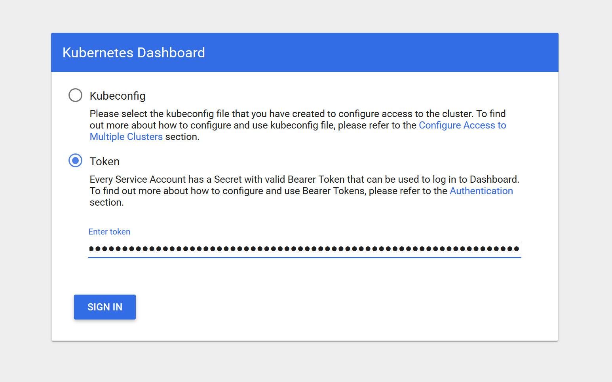
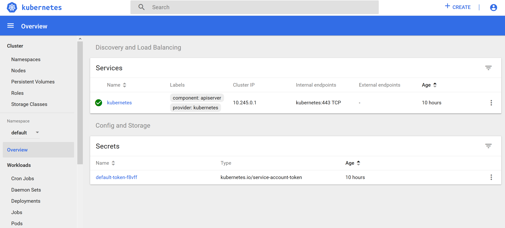

# Voorbereiding

## Software

- Installeer [kubectl](https://kubernetes.io/docs/tasks/tools/install-kubectl/)
- Installeer een text editor met YAML (of JSON) ondersteuning, bijvoorbeeld [Visual Studio Code](https://code.visualstudio.com/)

## kubectl configuratie

Kopieer van de USB stick de bestanden `config` en `token` naar `~/.kube` (bijvoorbeeld naar `C:\Users\ninckblokje\.kube`). Controleer de configuratie door het volgende commando uit te voeren:

````
$ kubectl get nodes
NAME                                        STATUS   ROLES    AGE   VERSION
k8s-1-13-5-do-1-ams3-1554623941376-1-7vyg   Ready    <none>   11h   v1.13.5
````

## Dashboard

Om verbinding te maken met het Dashboard moet het volgende commando gebruikt worden (deze blijft altijd open):

````
$ kubectl proxy
Starting to serve on 127.0.0.1:8001
````

De gehele K8S API is nu beschikbaar via http://localhost:8001. Het Dashboard kan bereikt worden via: http://localhost:8001/api/v1/namespaces/kube-system/services/https:kubernetes-dashboard:/proxy/#!/overview?namespace=default

De eerste keer moet een token worden ingevoerd. Gebruik hiervoor de inhoud van het bestand token.





## Notes

- Alle configuratie is in YAML formaat, maar zelf JSON opstellen is ook mogelijk
- Voorbeelden zijn met de namespace `ninckblokje` vervang deze door je eigen namespace